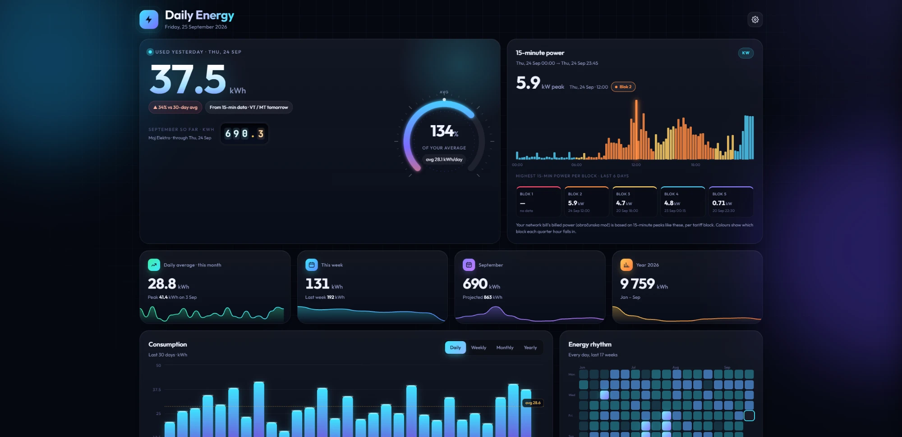
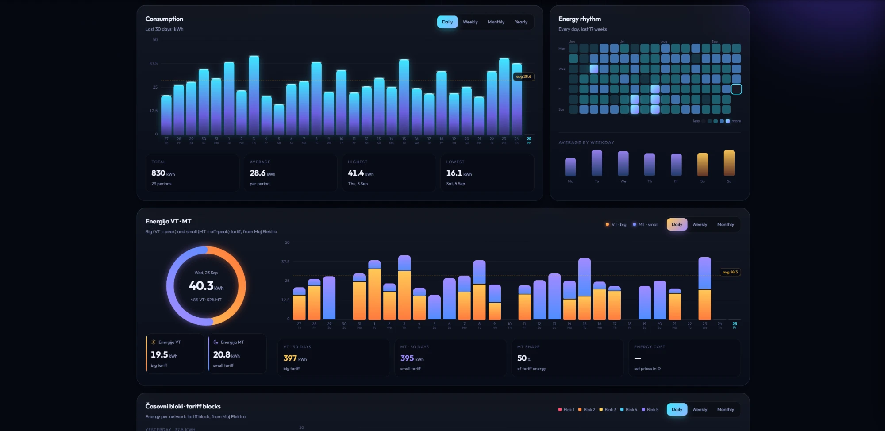
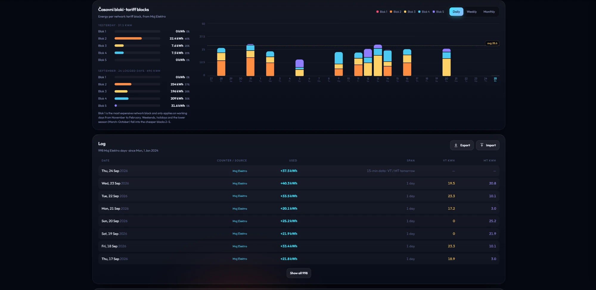

# Daily Energy for Moj Elektro

[Slovenščina](#slovenščina) · [English](#english)





---

## Slovenščina

Celozaslonska nadzorna plošča za porabo elektrike v Home Assistantu, ki deluje na podlagi
[integracije Moj Elektro](https://github.com/frlequ/homeassistant-mojelektro) avtorja frlequ.
Namestite jo, izberite svoje merilno mesto Moj Elektro in v stranski vrstici se pojavi stran **Daily Energy**.

### Kaj dobite

- **Včerajšnja poraba** na prvi pogled, v primerjavi s 30-dnevnim povprečjem.
- Grafi porabe po **dnevih, tednih, mesecih in letih**.
- Razdelitev na **Energijo VT / MT** (visoka in mala tarifa) po dnevih, tednih in mesecih.
- **Časovni bloki** – energija po omrežninskih blokih (Blok 1–5) po dnevih, tednih in mesecih.
- **15-minutna moč** z najvišjo 15-minutno močjo v posameznem bloku (osnova za obračunsko moč).
- **Energijski ritem** (toplotni prikaz) in povprečje po dnevih v tednu.
- **Dnevnik** vseh dni z uvozom zgodovine iz CSV izvozov portala Moj Elektro.
- Deluje za vse uporabnike vašega Home Assistanta, se osvežuje v živo in ima **lahki način** za počasne stenske tablice.

Vsaka vrednost je prikazana na dan, ko je bila energija dejansko porabljena (00:00–24:00).

### Zahteve

- Home Assistant 2024.12 ali novejši
- [Integracija Moj Elektro](https://github.com/frlequ/homeassistant-mojelektro), nastavljena z vašim API žetonom Moj Elektro

### Namestitev (HACS)

1. HACS → ⋮ → **Custom repositories** → dodajte `https://github.com/Sabotin/Daily-Energy-MojElektro`, kategorija **Integration**.
2. V HACS poiščite **Daily Energy for Moj Elektro** in jo prenesite.
3. Ponovno zaženite Home Assistant.
4. Nastavitve → Naprave in storitve → **Dodaj integracijo** → **Daily Energy for Moj Elektro**.
5. Izberite merilno mesto Moj Elektro (in po želji PIN). V stranski vrstici se pojavi **Daily Energy**.

Ročna namestitev: mapo `custom_components/daily_energy_mojelektro` skopirajte v svojo mapo `config/custom_components` in ponovno zaženite Home Assistant.

### Možnosti

Nastavitve → Naprave in storitve → Daily Energy for Moj Elektro → **Konfiguriraj**:

| Možnost | Kaj naredi |
|---|---|
| PIN | Zahteva se pred odpiranjem ročnega vnosa stanja števca in pred brisanjem odčitkov. Prazno = brez PIN-a. Preveri ga Home Assistant, v brskalniku ni shranjen. |
| Prikaži v stranski vrstici | Doda stran Daily Energy v stransko vrstico. |
| Lahki način za uporabnike | Uporabniška imena, ločena z vejico (npr. `tablet`). Njihova plošča je brez zamegljevanja in animacij. |

Cene energije za oceno stroškov nastavite na sami plošči (⚙).

### Vaša zgodovina (neobvezno)

Novi dnevi se beležijo samodejno od dneva namestitve. Za preteklost prenesite CSV izvoze s
[portala Moj Elektro](https://mojelektro.si) in uporabite **Dnevnik → Import**:

| Stran na portalu | Kaj doda |
|---|---|
| Dnevna stanja | Dnevna poraba z VT / MT in mesečnimi seštevki |
| Dnevne količine po časovnih blokih | Energija po časovnih blokih |
| 15 minutni podatki | 15-minutna moč (zadnji ~3 tedni) in natančni časovni bloki |

Uvoz lahko varno ponovite; dnevi se posodobijo, nikoli podvojijo. Uvažajo lahko samo skrbniki.

### Kako delujejo podatki

- Moj Elektro objavi **dnevni seštevek s števca** (in razdelitev VT / MT) približno **dva dni** kasneje,
  **15-minutne podatke in časovne bloke** pa en dan kasneje. Dokler seštevek s števca ne prispe, je včerajšnji dan
  prikazan iz 15-minutnih podatkov in označen s »15-min data«.
- Stanje števca z datumom D je odčitano ob 00:00 na dan D, zato je stanje(D + 1) − stanje(D) poraba dneva D.
- Dnevnik shrani Home Assistant sam (`.storage/daily_energy_mojelektro.*`) in je del vaših varnostnih kopij.
- Nič se ne pošilja drugam; plošča bere samo senzorje, ki jih ustvari integracija Moj Elektro.

Ploščo lahko dodate tudi na katerokoli obstoječo nadzorno ploščo kot kartico:

```yaml
type: custom:daily-energy-card
```

### Zasluge in licenca

Zgrajeno na [integraciji Moj Elektro](https://github.com/frlequ/homeassistant-mojelektro) avtorja frlequ (MIT).
Ta projekt ne vsebuje njene kode; bere le senzorje, ki jih ustvari.

Licenca MIT – glejte [LICENSE](LICENSE). Ni povezano z Elektro Slovenije ali katerim koli distribucijskim podjetjem.

---

## English

A full-screen energy dashboard for Home Assistant, built on top of the
[Moj Elektro integration](https://github.com/frlequ/homeassistant-mojelektro) by frlequ.
Install it, pick your Moj Elektro meter, and a **Daily Energy** page appears in the sidebar.

### What you get

- **Yesterday's usage** at a glance, compared with your 30-day average.
- **Daily, weekly, monthly and yearly** consumption charts.
- **Energija VT / MT** (big and small tariff) split, per day, week and month.
- **Časovni bloki** – energy per network tariff block (Blok 1–5), per day, week and month.
- **15-minute power** chart with the highest 15-minute power per tariff block (what your billed power is based on).
- **Energy rhythm** heat map and average by weekday.
- A **log** of every day, with CSV import of your history from the Moj Elektro portal.
- Works for every user of your Home Assistant, updates live, and has a **light mode** for slow wall tablets.

Every value is shown on the day the energy was actually used (00:00–24:00).

### Requirements

- Home Assistant 2024.12 or newer
- The [Moj Elektro integration](https://github.com/frlequ/homeassistant-mojelektro), set up with your Moj Elektro API token

### Installation (HACS)

1. HACS → ⋮ → **Custom repositories** → add `https://github.com/Sabotin/Daily-Energy-MojElektro`, category **Integration**.
2. Search for **Daily Energy for Moj Elektro** in HACS and download it.
3. Restart Home Assistant.
4. Settings → Devices & services → **Add integration** → **Daily Energy for Moj Elektro**.
5. Pick your Moj Elektro meter (and optionally a PIN). **Daily Energy** appears in the sidebar.

Manual installation: copy `custom_components/daily_energy_mojelektro` into your `config/custom_components` folder and restart.

### Options

Settings → Devices & services → Daily Energy for Moj Elektro → **Configure**:

| Option | What it does |
|---|---|
| PIN | Asked before opening the manual meter reading and before deleting readings. Empty = no PIN. Checked by Home Assistant, never stored in the browser. |
| Show in sidebar | Adds the Daily Energy page to the sidebar. |
| Light mode users | Comma-separated user names (for example `tablet`). Their dashboard skips blur and animations. |

Energy prices for the cost estimates are set in the dashboard itself (⚙).

### Your history (optional)

New days are logged automatically from the day you install it. To fill in the past, download CSV exports from the
[Moj Elektro portal](https://mojelektro.si) and use **Log → Import**:

| Portal page | What it adds |
|---|---|
| Dnevna stanja (daily meter readings) | Daily usage with VT / MT and month totals |
| Dnevne količine po časovnih blokih | Energy per tariff block |
| 15 minutni podatki | 15-minute power (last ~3 weeks) and exact tariff blocks |

Importing is safe to repeat; days are updated, never duplicated. Only administrators can import.

### How the data works

- Moj Elektro publishes a day's **meter-reading total** (and the VT / MT split) about **two days** later, and its
  **15-minute data and tariff blocks** one day later. Until the meter total arrives, yesterday is shown from the
  15-minute data and marked "15-min data".
- A meter reading dated D is taken at 00:00 on D, so reading(D + 1) − reading(D) is the usage of day D.
- The log is stored by Home Assistant itself (`.storage/daily_energy_mojelektro.*`) and is part of your backups.
- Nothing is sent anywhere; the dashboard only reads the sensors the Moj Elektro integration creates.

You can also add the dashboard to any existing dashboard as a card:

```yaml
type: custom:daily-energy-card
```

### Credits and licence

Built on the [Moj Elektro integration](https://github.com/frlequ/homeassistant-mojelektro) by frlequ (MIT).
This project does not include any of its code; it reads the sensors it creates.

MIT licence – see [LICENSE](LICENSE). Not affiliated with Elektro Slovenije or any distribution company.
