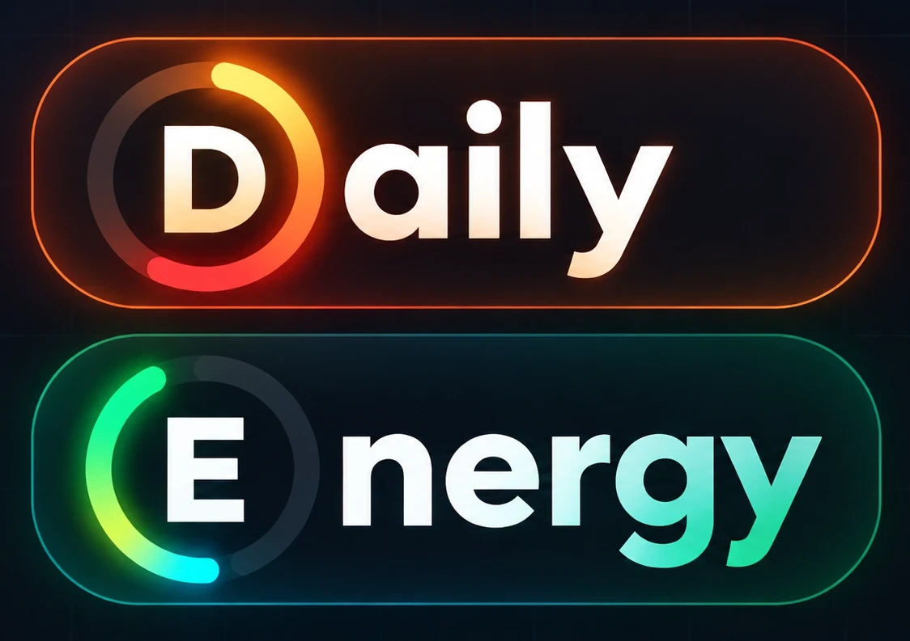
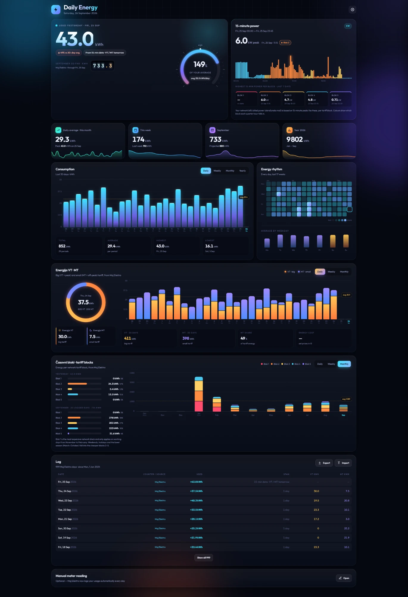

<p align="center"></p>

# Daily Energy for Moj Elektro



Energy dashboard for Home Assistant, straight from the Moj Elektro API. Enter your meter ID and API token – done.

## Features

- Yesterday's usage vs. your 30-day average
- Daily, weekly, monthly and yearly charts
- VT / MT split
- Tariff blocks 1–5
- 15-minute power with the peak per block
- Energy rhythm heat map
- Full history from Moj Elektro, any date range
- Grid out for solar panels (optional)
- English or Slovenian
- Light mode for wall tablets

## Requirements

- Home Assistant 2024.12+
- Moj Elektro **API token**: [mojelektro.si](https://mojelektro.si) → Moj profil → **Kreiraj žeton** (unlimited expiration)
- **Meter ID** (EIMM): Merilna mesta / merilne točke, e.g. `4-123456`

## Install

[](https://my.home-assistant.io/redirect/hacs_repository/?owner=Sabotin&repository=Daily-Energy-MojElektro&category=integration)

1. Click the button above → **Download** → restart Home Assistant
2. Add the integration and enter your meter ID and API token – **Daily Energy** appears in the sidebar

   [](https://my.home-assistant.io/redirect/config_flow_start/?domain=daily_energy_mojelektro)

<details><summary>Without the button</summary>

HACS → ⋮ → **Custom repositories** → `https://github.com/Sabotin/Daily-Energy-MojElektro` (Integration) → download →
restart → Settings → Devices & services → **Add integration** → **Daily Energy for Moj Elektro**.

</details>

As a card on any dashboard:

```yaml
type: custom:daily-energy-card
```

## Settings

**Integration** (Settings → Devices & services → Daily Energy → Configure): PIN, sidebar, meter ID, new API token.

**Dashboard** (⚙):

| | |
|---|---|
| Language | Automatic, English or Slovenščina (per device) |
| Grid | Grid in, or Grid in & Grid out |
| This device | Automatic, Light or Full (per device) |
| Moj Elektro history | Import any date range |
| Prices | VT / MT price for cost estimates |
| Your data | Export, import CSV / JSON, delete all data |

## Good to know

- New data is checked every hour. Yesterday's 15-minute data arrives at about 06:00, the meter total (with VT / MT) a day later – until then yesterday is shown from the 15-minute data.
- Everything is stored in Home Assistant and included in its backups. The token never reaches the browser.

## Licence

MIT – see [LICENSE](LICENSE). Not affiliated with Elektro Slovenije or any distribution company.
