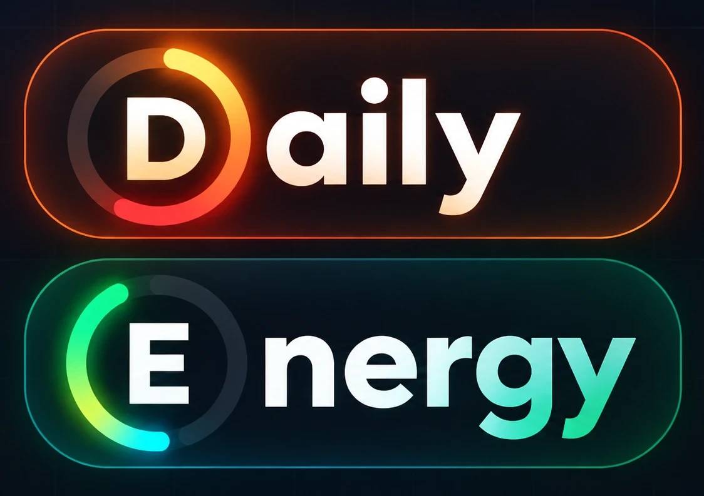
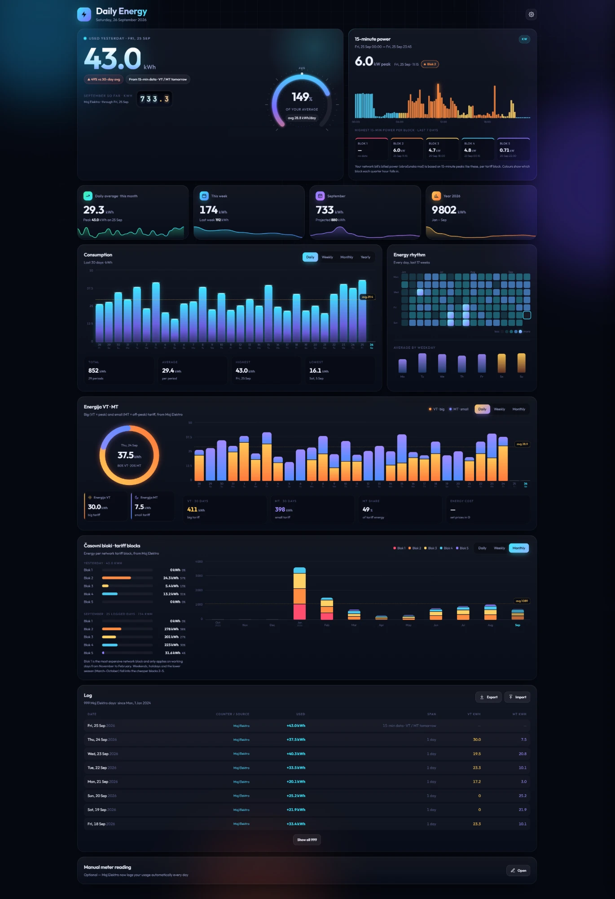

<p align="center"></p>

<p align="center"><b>Slovenščina</b> · <a href="#daily-energy-for-moj-elektro">English</a></p>

# Dnevni pregled porabe za Moj Elektro



Pregled porabe energije za Home Assistant, neposredno iz API-ja Moj Elektro.

## Funkcije

- Včerajšnja poraba v primerjavi s 30-dnevnim povprečjem
- Grafi dnevne, tedenske, mesečne in letne porabe
- Ločen prikaz VT / MT
- Tarifni bloki 1–5
- Moč v 15-minutnih intervalih z najvišjo vrednostjo za posamezen blok
- Dogovorjena moč: najvišja 15-minutna moč po dnevih in mesecih glede na dogovorjeno, s presežno močjo po blokih, izračunano kot na računu; za novega uporabnika obračunska moč, ki je najvišja 15-minutna moč v mesecu
- Stalna poraba: kar teče ves čas, iz 15-minutnih podatkov, s stroškom na leto; teden, mesec in leto v primerjavi z enakim obdobjem prej
- Ocena računa za prejšnji in tekoči mesec: energija, omrežnina, prispevki in DDV (tudi samooskrba z letnim obračunom); okvirne cene energije ali vaše cene, vpisane kar na kartici
- Toplotni zemljevid vzorca porabe
- Celotna zgodovina podatkov iz Moj Elektro za poljubno časovno obdobje
- Oddaja energije v omrežje za sončne elektrarne (izbirno)
- Slovenščina ali angleščina
- Lahek način za tablice na steni

## Zahteve

- Home Assistant 2024.12+
- API-žeton Moj Elektro: [mojelektro.si](https://mojelektro.si) → Moj profil → **Kreiraj žeton** (neomejena veljavnost)
- ID merilnega mesta (EIMM): Merilna mesta / merilne točke, npr. `4-123456`

## Namestitev

[](https://my.home-assistant.io/redirect/hacs_repository/?owner=Sabotin&repository=Daily-Energy-MojElektro&category=integration)

1. Kliknite zgornji gumb → **Download** → ponovno zaženite Home Assistant
2. Dodajte integracijo **Daily Energy MojElektro** in vnesite ID merilnega mesta ter API-žeton – **Daily Energy** se nato prikaže v stranski vrstici

   [](https://my.home-assistant.io/redirect/config_flow_start/?domain=daily_energy_mojelektro)

<details><summary>Brez gumba</summary>

HACS → ⋮ → **Custom repositories** → `https://github.com/Sabotin/Daily-Energy-MojElektro` (Integration) → download →
restart → Settings → Devices & services → **Add integration** → **Daily Energy for Moj Elektro**.

</details>

Kot kartico na poljubni nadzorni plošči:

```yaml
type: custom:daily-energy-card
```

## Nastavitve

**Integracija** (Settings → Devices & services → Daily Energy → Configure): PIN, prikaz v stranski vrstici, ID merilnega mesta, nov API-žeton.

**Nadzorna plošča** (⚙):

| | |
|---|---|
| Jezik | Samodejno, English ali Slovenščina (za vsako napravo posebej) |
| Omrežje | Odjem, ali Odjem in oddaja |
| Ta naprava | Samodejno, Lahek ali Poln (za vsako napravo posebej) |
| Zgodovina Moj Elektro | Uvoz poljubnega časovnega obdobja |
| Vaši podatki | Izvoz, uvoz CSV / JSON, brisanje vseh podatkov |

## Dobro je vedeti

- Novi podatki se preverijo vsako jutro med 06:05 in 11:05 in ob osvežitvi (do 5-krat na dan), vedno za zadnje 3 dni. Starejše dni prenesete sami v Nastavitve (⚙) → Zgodovina Moj Elektro. Včerajšnji 15-minutni podatki so običajno na voljo okoli 06:00, skupna poraba števca (z VT / MT) pa šele naslednji dan. Do takrat se včerajšnja poraba prikazuje na podlagi 15-minutnih podatkov.
- Vse se shranjuje v Home Assistant in je vključeno v njegove varnostne kopije. API-žeton nikoli ne pride do brskalnika.

## Licenca

Vse pravice pridržane – glejte [LICENSE](LICENSE). Integracijo lahko namestite in uporabljate v svojem Home Assistantu za osebno, nekomercialno rabo. Kopiranje, spreminjanje, deljenje, objavljanje, ponovna uporaba delov kode ali prodaja brez pisnega dovoljenja avtorja niso dovoljeni. Projekt ni povezan z Elektro Slovenije ali katerim koli distribucijskim podjetjem.

---

<p align="center"><a href="#dnevni-pregled-porabe-za-moj-elektro">Slovenščina</a> · <b>English</b></p>

# Daily Energy for Moj Elektro

Energy dashboard for Home Assistant, straight from the Moj Elektro API.

## Features

- Yesterday's usage vs. your 30-day average
- Daily, weekly, monthly and yearly charts
- VT / MT split
- Tariff blocks 1–5
- 15-minute power with the peak per block
- Agreed power: the highest 15-minute power per day and month against the agreed power, with excess power per block worked out like on the bill; for a new user, the billed power: the month's highest 15-minute power
- Always-on use: what runs all the time, from the 15-minute data, with its cost a year; week, month and year against the same span before
- Estimated bill for last month and this month: energy, network charge, levies and VAT (also yearly-netted self-supply); typical energy prices, or your own typed right on the card
- Energy rhythm heat map
- Full history from Moj Elektro, any date range
- Grid out for solar panels (optional)
- English or Slovenian
- Light mode for wall tablets

## Requirements

- Home Assistant 2024.12+
- Moj Elektro **API token**: [mojelektro.si](https://mojelektro.si) → Moj profil → **Kreiraj žeton** (unlimited expiration)
- **Meter ID** (EIMM): Merilna mesta / merilne točke, e.g. `4-123456`

## Install

[](https://my.home-assistant.io/redirect/hacs_repository/?owner=Sabotin&repository=Daily-Energy-MojElektro&category=integration)

1. Click the button above → **Download** → restart Home Assistant
2. Add the integration and enter your meter ID and API token – **Daily Energy** appears in the sidebar

   [](https://my.home-assistant.io/redirect/config_flow_start/?domain=daily_energy_mojelektro)

<details><summary>Without the button</summary>

HACS → ⋮ → **Custom repositories** → `https://github.com/Sabotin/Daily-Energy-MojElektro` (Integration) → download →
restart → Settings → Devices & services → **Add integration** → **Daily Energy for Moj Elektro**.

</details>

As a card on any dashboard:

```yaml
type: custom:daily-energy-card
```

## Settings

**Integration** (Settings → Devices & services → Daily Energy → Configure): PIN, sidebar, meter ID, new API token.

**Dashboard** (⚙):

| | |
|---|---|
| Language | Automatic, English or Slovenščina (per device) |
| Grid | Grid in, or Grid in & Grid out |
| This device | Automatic, Light or Full (per device) |
| Moj Elektro history | Import any date range |
| Your data | Export, import CSV / JSON, delete all data |

## Good to know

- New data is checked every morning between 06:05 and 11:05 and when you refresh (up to 5 times a day), always for the last 3 days. Older days you fetch yourself in Settings (⚙) → Moj Elektro history. Yesterday's 15-minute data arrives at about 06:00, the meter total (with VT / MT) a day later – until then yesterday is shown from the 15-minute data.
- Everything is stored in Home Assistant and included in its backups. The token never reaches the browser.

## Licence

All rights reserved – see [LICENSE](LICENSE). You may install and use the integration in your own Home Assistant for personal, non-commercial use. Copying, modifying, sharing, publishing, reusing parts of the code or selling it without the author's written permission is not allowed. Not affiliated with Elektro Slovenije or any distribution company.
